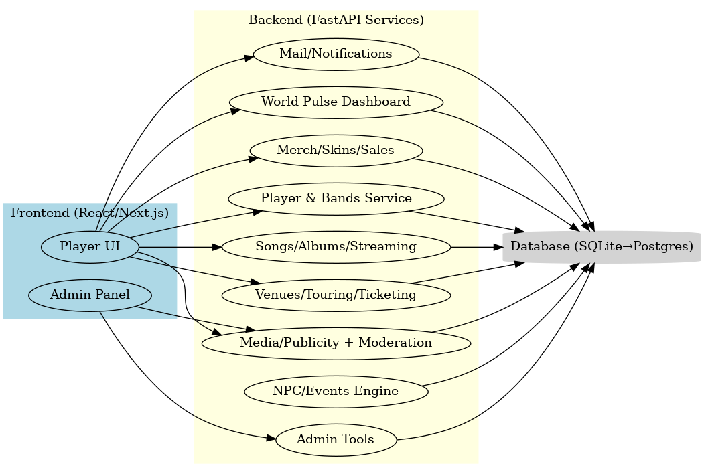
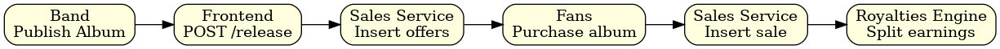
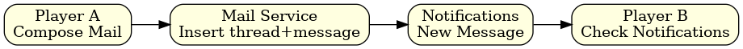
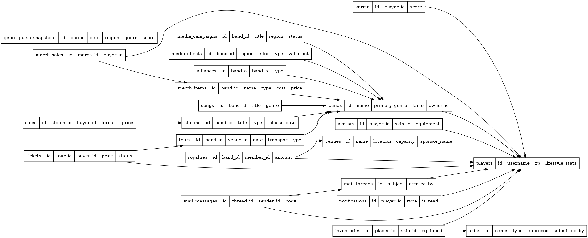
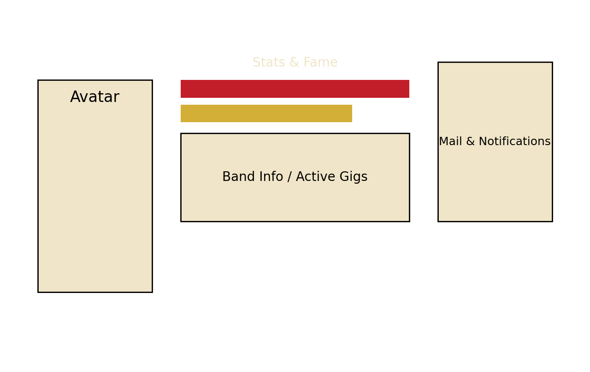
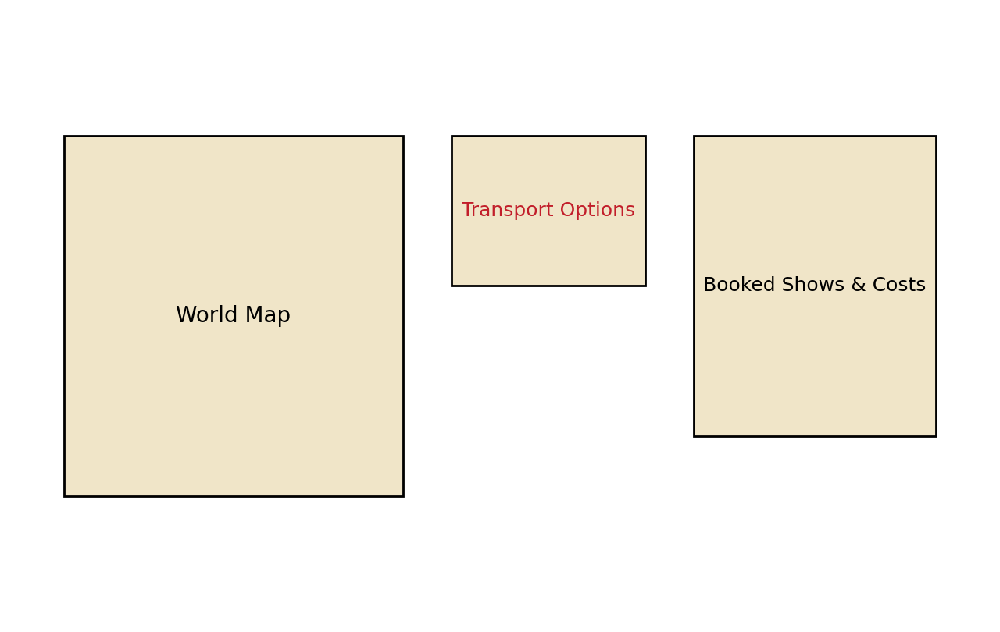
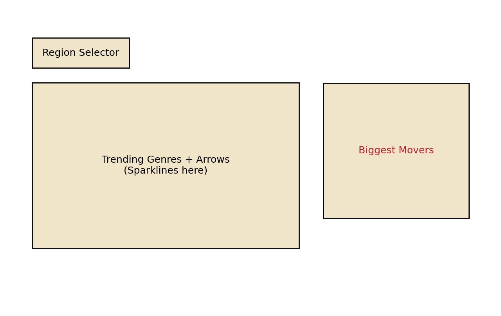

# RockMundo Technical Design Document (Expanded)

## High-Level Architecture

## Sequence Diagrams

### Tour Booking

### Album Sales

### Mail + Notifications

### World Pulse Daily Job

### Venue Sponsorship

## Database Schema (ERD)

---
All diagrams generated via Graphviz for inclusion in repo/docs.

## Frontend Wireframes
### Player Dashboard

### Tour Planner

### World Pulse Dashboard

